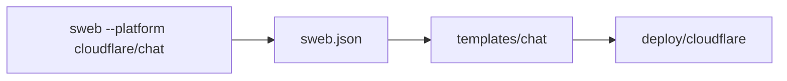

# SwiftWeb Cloudflare

Cloudflare platform templates for SwiftWeb.

This repository is referenced by `sweb --platform cloudflare` and by explicit
GitHub references such as `sweb --platform 1amageek/swift-web-cloudflare/chat`.

| Path | Purpose |
|---|---|
| `sweb.json` | Adapter template manifest consumed by `sweb`. |
| `templates/new` | Default Cloudflare Worker scaffold. |
| `templates/chat` | Cloudflare Worker scaffold for chat-oriented apps. |

The template directories are copied relative to the SwiftWeb app package root.
